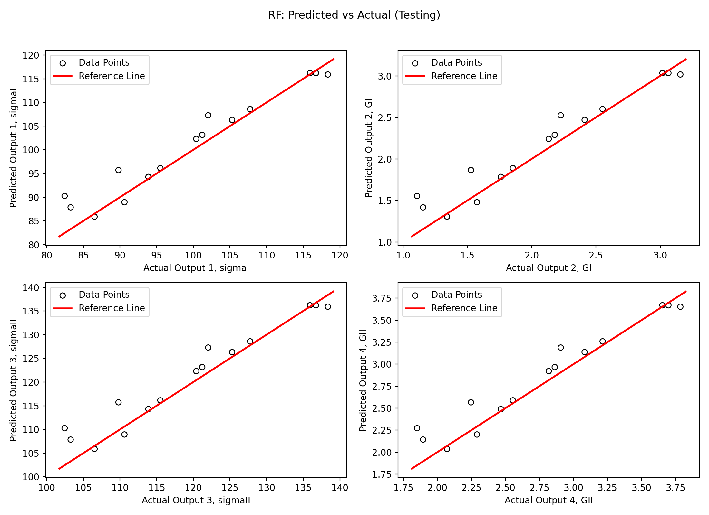
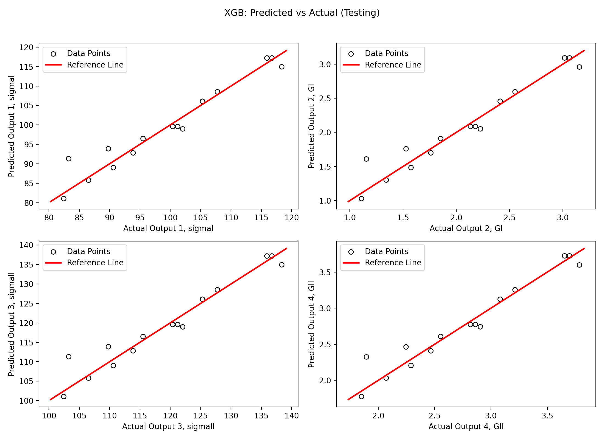

# Parameter Prediction from Simulation-Derived Cohesive-Zone Features

## Abstract

This work presents a reproducible data-processing and machine-learning pipeline for predicting fracture-mechanics parameters from simulation traces. The pipeline extracts physically meaningful features from displacement–force responses, pairs them with target cohesive-zone parameters, and evaluates several regression models—including Support Vector Regression (SVR), Random Forests (RF), and XGBoost. The framework supports automatic feature extraction, dataset assembly, hyperparameter tuning, model persistence, and visual performance assessment. The resulting workflow enables rapid experimentation and systematic comparison of ML models for surrogate prediction in fracture simulations.

## 1. Introduction

Cohesive-zone models are widely used to characterize fracture processes through parameters such as peak traction (`σI`, `σII`) and energy release rates (`GI`, `GII`). Obtaining these parameters through full-scale numerical simulations is computationally expensive. To reduce this cost, we propose a supervised machine-learning pipeline that predicts cohesive-zone parameters directly from low-dimensional features extracted from simulation trace data.

This repository implements the complete workflow—from data ingestion to model training and evaluation—and provides a reproducible framework suitable for research, benchmarking, and extension.

## 2. Workflow Overview

The overall pipeline consists of four stages:

1. Feature Extraction — displacement–force traces are processed to compute summary features (peak force `Pmax`, characteristic displacement `δ*`, area under the curve `At`, initial slope `m`).
2. Dataset Assembly — extracted features are merged with target cohesive-zone parameters stored in `data/target_features/increasing_targets.csv`.
3. Model Training and Hyperparameter Tuning — SVR, RF, and XGBoost models are optimized through cross-validated grid searches.
4. Evaluation and Inference — trained models are evaluated with R² and MAPE metrics and saved as portable artifacts used for downstream inference.

## 3. Repository Structure

Core components

- `predict.py` — Primary feature-extraction and dataset-construction script.
- `src/data_loading.py` — Utilities for loading and validating input data.
- `src/model_prediction.py` — Model training pipeline with hyperparameter tuning and visualization helpers.
- `src/predict_from_models.py` — Inference script for applying trained models to new samples.

Data and output directories

- `data/Simulation/` — raw simulation traces (`sample_*.csv`).
- `data/target_features/increasing_targets.csv` — ground-truth cohesive-zone parameters.
- `data/combined_dataset.csv` — training dataset (features + targets).
- `data/output_results/` — grid-search outputs and summary files.
- `models/` — serialized models, scalers, and metadata (joblib).
- `figures/` — saved predicted-vs-actual plots.

## 4. Methods

### 4.1 Feature Extraction

Each simulation file is scanned for displacement and force columns, tolerating minor variations in naming. Numerical arrays are processed to compute the following features, which are saved to `data/features_only.csv` and later joined with target parameters:

| Feature | Description |
|--------:|:------------|
| `Pmax`  | Maximum force value |
| `δ*`    | Displacement at peak force |
| `At`    | Integral of force–displacement curve |
| `m`     | Initial tangent stiffness (slope) |

### 4.2 Model Training

All models operate on standardized features (`StandardScaler`). Hyperparameter tuning uses k-fold cross-validation across predefined grids:

- SVR: exploring combinations of `(ε, C)`.
- Random Forest: varying `n_estimators`.
- XGBoost: grid over `(n_estimators, max_depth, learning_rate)`.

For each configuration, R² and MAPE are computed for all target parameters, and average metrics are logged to CSV files in `data/output_results/`.

## 5. Results

### 5.1 SVR Tuning Summary

Example aggregated performance (from `data/output_results/svr_grid_combined.csv`):

| ε     | C    | mean_R² | mean_MAPE (%) |
|-----:|-----:|--------:|--------------:|
| 0.01 | 0.1  |  −15.32 |         11.94 |
| 0.02 | 0.7  |   −9.61 |          7.48 |
| 0.03 | 1.0  |   −8.65 |          6.82 |
| 0.04 | 2.0  |   −5.14 |          5.78 |
| 0.05 | 3.0  |   −3.82 |          5.46 |

### 5.2 Random Forest Tuning

Per-`n_estimators` mean MAPE (from `data/output_results/rf_trees_cv_results.csv`):

| n_estimators | mean_MAPE (%) |
|-------------:|--------------:|
| 5            | 3.7334        |
| 10           | 3.5512        |
| 36           | 3.1234        |
| 82           | 3.1412        |
| 140          | 3.0031        |
| 260          | **2.9566**    |
| 480          | 3.0069        |
| 650          | 2.9765        |

### 5.3 XGBoost Tuning

Grid search summary (from `data/output_results/xgb_grid_results.csv`):

| n_estimators | max_depth | learning_rate | mean_MAPE (%) |
|-------------:|:---------:|:-------------:|--------------:|
| 50           | 5         | 0.10          | 3.3406        |
| 100          | 5         | 0.10          | 3.5324        |
| 200          | 5         | 0.10          | 3.5533        |
| 50           | 3         | 0.10          | 3.8557        |
| 100          | 3         | 0.10          | 4.0196        |
| 200          | 3         | 0.10          | 4.0374        |
| 200          | 5         | 0.01          | 4.2928        |
| 200          | 3         | 0.01          | 4.7379        |
| 100          | 5         | 0.01          | 8.1027        |
| 100          | 3         | 0.01          | 8.5051        |
| 50           | 5         | 0.01          | 11.9684       |
| 50           | 3         | 0.01          | 12.2566       |

### 5.4 Visual Evaluation

Predicted-vs-actual plots (saved under `figures/`) illustrate model performance for each target parameter (`σI`, `GI`, `σII`, `GII`). These figures provide a qualitative assessment of correlation and error distribution.

## 6. Inference

Trained models, together with scalers and feature metadata, are stored as joblib dictionaries in `models/`. Run inference with:

```bash
python src/predict_from_models.py \
  --sample-file data/Simulation/sample_1.csv \
  --models-dir models \
  --out data/output_results/predictions_from_models.csv
```

The script re-extracts features, applies the correct scaling transformation, and writes predictions to the specified output CSV.

## 7. Discussion and Recommendations

RF and XGBoost generally outperform SVR on the present dataset in terms of MAPE. The pipeline is modular and extensible — suggestions include nested cross-validation, uncertainty quantification, additional model families (LightGBM, neural nets), and experiment tracking (MLflow, Weights & Biases).

## 8. Conclusion

This repository provides a reproducible environment for predicting cohesive-zone parameters from simulation data. By automating feature extraction, dataset construction, model optimization, visualization, and inference, the workflow supports systematic surrogate-model development for fracture simulation studies.

## 9. Suggested Extensions

- Add unit tests for feature extraction robustness.
- Incorporate additional models (LightGBM, MLP, Gaussian Processes).
- Integrate experiment tracking (Weights & Biases, MLflow).
- Provide Docker and `pyproject.toml` for reproducible environments.
- Extend to multi-fidelity or physics-informed learning frameworks.

## Acknowledgements

[Insert advisor/group/lab acknowledgement if applicable.]

---

If you would like this converted to a LaTeX paper (IEEE/ACM/Elsevier), a 2-page extended abstract, or a poster layout, tell me which format and I'll generate it.
# Parameter_prediction

This repository provides a  data-processing and machine-learning pipeline
for predicting cohesive-zone parameters from simulation traces. The code
extracts features from simulation CSVs, pairs them with target values, and
trains/evaluates ML models (SVR, Random Forest, simple ANN) to reproduce the
baseline experiments.


## Project overview

- Extract features (Pmax, delta_star, At, initial slope m) from simulation CSV
  files located in `data/Simulation/` 
- Combine extracted features with target variables (stored in
  `data/target_features/increasing_targets.csv`).
- Run hyperparameter grids / CV for SVR and Random Forest, train final models,
  and evaluate with R² and MAPE.

Key scripts

- `predict.py` — feature extraction, builds `data/features_only.csv` and
  `data/combined_dataset.csv`. Also demonstrates minimal end-to-end flow.
- `src/data_loading.py` — (earlier project version) dataset assembly helper.
- `src/model_prediction.py` — model tuning, training and evaluation (SVR and RF
  implementations, saving to `models/`).

## Repository layout

Important files and folders:

- `predict.py` — main feature extraction + combine script (entry point).
- `src/` — supporting modules: `data_loading.py`, `model_prediction.py`.
- `data/` — inputs and outputs
  - `Simulation/` — many `sample_*.csv` files (simulation traces)
  - `target_features/` — `increasing_targets.csv` (targets per sample)
  - `features_only.csv` — extracted features (created by `predict.py`)
  - `combined_dataset.csv` — features + targets (created by `predict.py`)
  - `svr_grid_results.csv`, `rf_trees_cv_results.csv` — tuning outputs
  - `output_results/` — directory containing output result CSVs
- `models/` — (created by `src/model_prediction.py`) saved model files

## Quickstart

1) Create and activate a Python environment (example for macOS / zsh):

```bash
python -m venv .venv
source .venv/bin/activate
python -m pip install -U pip
```

2) Install minimal dependencies (these match the project's imports):

```bash
pip install pandas numpy scikit-learn joblib openpyxl
```

3) Extract features from simulation CSVs and build the combined dataset:

```bash
# from project root
python predict.py

# This writes `data/features_only.csv` and `data/combined_dataset.csv`
```

4) Run model tuning / training (example using the script in `src`):

```bash
python src/model_prediction.py

# This will produce tuning CSVs in `data/` and save models into `models/`
```

## Inputs and outputs

Inputs
- Simulation traces: `Simulation/sample_*.csv` (each should contain
  displacement & force columns)
- Targets: `data/target_features/increasing_targets.csv`

Outputs
- `data/features_only.csv` — extracted per-sample features
- `data/combined_dataset.csv` — features joined with targets (ready for ML)
- `data/svr_grid_results.csv`, `data/rf_trees_cv_results.csv` — tuning results
- `models/` — saved trained models and scalers (`*.joblib`)

## Notes, assumptions and tips

- The feature extraction in `predict.py` attempts to be robust to slightly
  different CSV column names; it looks for numeric columns and prefers names
  `displacement`/`force` when available.
- If files are malformed or missing required columns the current code raises
  an error; you can catch and continue if you prefer to skip bad files.
- The ML scripts standardize features before training — this is required for
  SVR and recommended for ANN and RF here.
- For research-grade experiments, increase cross-validation folds, use nested
  CV for hyperparameter selection, and log random seeds and package versions
  for reproducibility.

## How I validated this README

- I inspected `predict.py` and `src/model_prediction.py` to list the expected
  inputs/outputs and commands.

## Next steps (suggested)

- Add a `requirements.txt` (pip freeze) or `pyproject.toml` for reproducible
  installs.
- Add a small driver script or `Makefile` to automate the sequence
  (extract -> combine -> tune -> train -> evaluate).
- Add unit tests for feature extraction edge cases (missing columns, short
  traces) under a `tests/` folder.

## Contact / author

# Parameter_prediction

This repository contains a reproducible data-processing and machine-learning
pipeline for predicting fracture-mechanics outputs (for example:
`sigmaI`, `GI`, `sigmaII`, `GII`) from simulation-derived input features
(`delta_star`, `Pmax`, `At`, `m`). It includes feature extraction, model
training and hyperparameter tuning (SVR, Random Forest, XGBoost), plotting of
predicted-vs-actual, and a small inference helper to load saved models and
produce predictions on new samples.

**Visual Workflow**


- **Data -> Features -> Train/Tune -> Save -> Predict & Plot**
- Example result plots are saved under `figures/` (e.g. `figures/svr_test.png`).

**Quick Start**

- **Create and activate a venv (macOS / zsh)**:

```bash
python -m venv dvenv
source dvenv/bin/activate
python -m pip install -U pip
```

- **Install dependencies**:

```bash
pip install -r requirements.txt
```

- **Extract features** (build a combined dataset):

```bash
python predict.py
# produces `data/features_only.csv` and `data/combined_dataset.csv`
```

- **Train models and run tuning**:

```bash
python src/model_prediction.py
# produces tuning CSVs in `data/output_results/`, saved models in `models/`, and figures in `figures/`
```

- **Run inference** against saved models:

```bash
python src/predict_from_models.py --sample-file data/Simulation/sample_1.csv --models-dir models --out data/output_results/predictions_from_models.csv
```

**Project layout (high level)**

- **`predict.py`**: Feature extraction from `data/Simulation/*.csv` and assembly of `combined_dataset.csv`.
- **`src/data_loading.py`**: Helpers to load and validate datasets.
- **`src/model_prediction.py`**: Training entrypoint — tuning functions for SVR, RF and XGB, evaluation and plotting helpers.
- **`src/predict_from_models.py`**: Loads joblib artifacts from `models/` and runs predictions on sample CSVs or rows.
- **`data/output_results/`**: Tuning CSVs and saved summaries (e.g., `svr_grid_results.csv`, `rf_trees_cv_results.csv`, `xgb_grid_results.csv`).
- **`models/`**: Saved models as joblib dictionaries containing `{'model','scaler','features','targets'}`.
- **`figures/`**: Saved PNGs of predicted vs actual comparisons.

**Detailed workflow**

1. Data preparation
   - Raw simulation traces: `data/Simulation/sample_*.csv`.
   - Targets: `data/target_features/increasing_targets.csv`.
   - Run `python predict.py` to extract features and create `data/combined_dataset.csv`.

2. Training & tuning (`src/model_prediction.py`)
   - Loads `data/combined_dataset.csv` and splits into train/test.
   - Standardizes inputs with `StandardScaler`.
   - SVR tuning: can be run against an explicit list of `(epsilon, C)` pairs or a default grid. Results written to `data/output_results/svr_grid_results.csv`.
   - RF tuning: evaluates `n_estimators` values and writes `data/output_results/rf_trees_cv_results.csv`.
   - XGBoost tuning: grid over `(n_estimators, max_depth, learning_rate)` and writes `data/output_results/xgb_grid_results.csv`.
   - Best models are fitted and saved to `models/`.

3. Evaluation & visualization
   - `evaluate_model(...)` prints per-target Train/Test R² and Test MAPE.
   - `plot_pred_vs_actual(...)` saves 2×2 predicted-vs-actual figures in `figures/`.

4. Inference
   - `src/predict_from_models.py` loads joblib model files and applies scaling + prediction to new samples; output CSV is written to `data/output_results/`.

**File examples & important outputs**

- `data/output_results/combined_dataset.csv`: features + target table used for training.
- `data/output_results/svr_grid_results.csv`: per-(epsilon,C) tuning rows.
- `data/output_results/svr_grid_combined.csv`: aggregated (epsilon,C) summary (created by analysis helper).
- `models/svr_model.joblib`: saved SVR model with scaler and metadata.
- `figures/svr_test.png`: example predicted vs actual for SVR on test data.

## Results (example run)

The repository includes example outputs from a recent training run under `figures/` and `data/output_results/`.

### Key numeric summaries

SVR aggregated (per (epsilon, C)) — `data/output_results/svr_grid_combined.csv`:

| epsilon | C   | mean_R2  | mean_MAPE_percent |
|--------:|:----|---------:|------------------:|
| 0.01    | 0.1 | -15.3216 | 11.9350           |
| 0.02    | 0.7 |  -9.6127 |  7.4810           |
| 0.03    | 1.0 |  -8.6550 |  6.8161           |
| 0.04    | 2.0 |  -5.1397 |  5.7769           |
| 0.05    | 3.0 |  -3.8156 |  5.4579           |

Random Forest tuning (`data/output_results/rf_trees_cv_results.csv`) — per-`n_estimators` mean MAPE (last column):

| n_estimators | mean_MAPE_percent |
|-------------:|------------------:|
| 5           | 3.7334061192256796 |
| 10          | 3.5511693461971    |
| 36          | 3.123350339664438  |
| 82          | 3.141227276471558  |
| 140         | 3.0031412245738154 |
| 260         | 2.9566413921634713 |
| 480         | 3.0069444146553392 |
| 650         | 2.9765428263157334 |

XGBoost tuning (`data/output_results/xgb_grid_results.csv`) — full grid results:

| n_estimators | max_depth | learning_rate | mean_MAPE_percent |
|-------------:|:---------:|:-------------:|------------------:|
| 50          | 5         | 0.1           | 3.340641378618129 |
| 100         | 5         | 0.1           | 3.532382746875707 |
| 200         | 5         | 0.1           | 3.553320590738006 |
| 50          | 3         | 0.1           | 3.8557428656200643 |
| 100         | 3         | 0.1           | 4.019602325870569 |
| 200         | 3         | 0.1           | 4.037388055034631 |
| 200         | 5         | 0.01          | 4.292752408959229 |
| 200         | 3         | 0.01          | 4.737946086131571 |
| 100         | 5         | 0.01          | 8.102686433461724 |
| 100         | 3         | 0.01          | 8.505053040724977 |
| 50          | 5         | 0.01          | 11.96836056746445 |
| 50          | 3         | 0.01          | 12.256636200773077 |

### Figures (thumbnails)

- **SVR (test):**  
  {width=240}  
  Predicted vs actual comparison for the SVR model on the test set.

- **Random Forest (test):**  
  {width=240}  
  Predicted vs actual comparison for the Random Forest model on the test set.

- **XGBoost (test):**  
  {width=240}  
  Predicted vs actual comparison for the XGBoost model on the test set.

If you want I can further adjust thumbnail sizes, add captions per subplot, or inline small CSV excerpts. I can also commit a `results/` README with more detailed run metadata (timestamp, command used, best-params details).
**Troubleshooting**

- If you see import errors for `matplotlib` or `xgboost`, install them explicitly:

```bash
pip install matplotlib xgboost
```

- If `svr_grid_results.csv` is missing but the script expects it, either run the SVR tuner (the script can be configured to evaluate the small, explicit `(epsilon, C)` list) or allow the script to run the tuner by removing any `svr_best` override.

**Extending the project**

- Add a new `hyper_tune_<model>` function to follow the existing pattern and add it to the training pipeline.
- Add unit tests under `tests/` for feature extraction and small model smoke tests.
- Add `Makefile` or `tasks` to automate the sequence `extract -> combine -> tune -> train -> evaluate`.

---

If you want, I can now:

- **A**: Embed actual thumbnails of `figures/*.png` into this README so users see immediate visual results (I will insert inline markdown image links);
- **B**: Create a `docs/` folder with step-by-step screenshots and runnable examples for non-technical users.

Reply with `A` or `B` (or `neither`) and I will update the repo accordingly.
